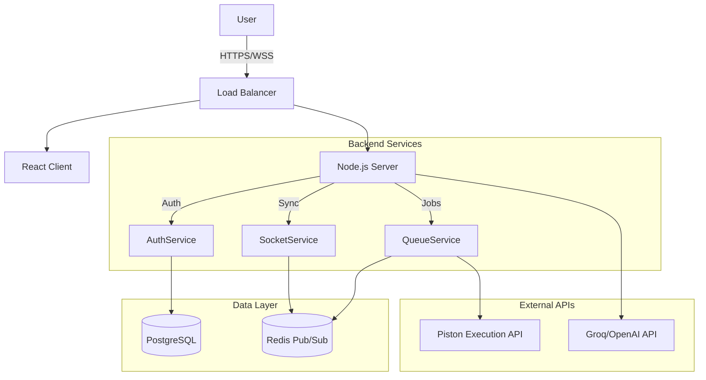
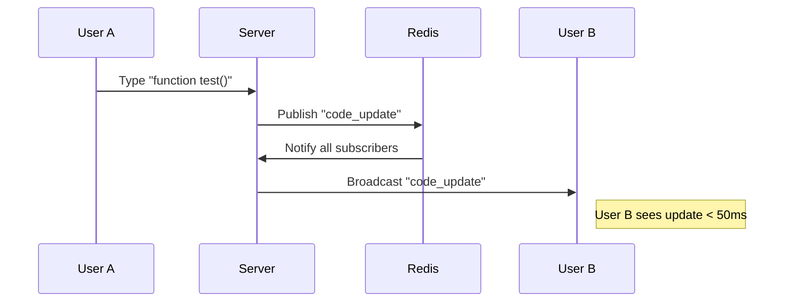
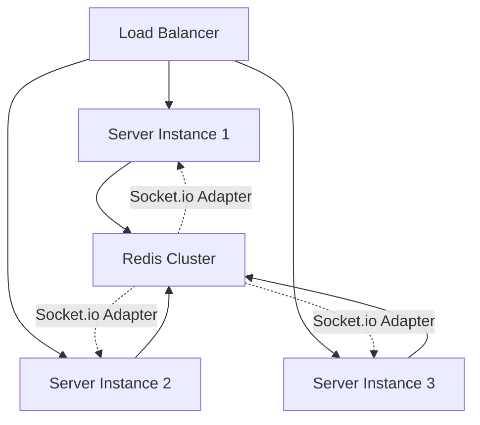

# System Architecture

## Overview

CodeCollab is a distributed real-time system designed for high-concurrency collaborative coding. It leverages a microservices-like architecture (monolith with separated services) to ensure low latency and high availability.

## High-Level Architecture

## Data Flow: Real-Time Synchronization

We use a simplified operational transformation approach via Socket.io rooms to ensure sub-100ms latency.

## Core Components

### 1. The Collaboration Engine
- **Technology**: Socket.io + Redis Adapter
- **Function**: Handles transient state (cursor positions, selection) and persistent state (file contents).
- **Optimization**: Debounced writes to the database, instant broadcasting to peers.

### 2. Code Execution Sandbox
- **Technology**: Piston API (Docker-based)
- **Security**: Code runs in isolated containers with network access disabled and resource limits enforced.
- **Workflow**:
  1. Client sends code.
  2. Server validates and pushes to BullMQ queue.
  3. Worker processes queue and calls Piston.
  4. Result is broadcasted back to the room.

### 3. AI Copilot Layer
- **Technology**: Groq (Llama 3 70B)
- **Function**: Provides context-aware hints and code reviews.
- **Caching**: All AI responses are cached in Redis for 24 hours based on code content hash to reduce costs.

## Database Schema

We use Prisma ORM with PostgreSQL.

- **User**: Auth & Profile
- **Room**: Collaboration session settings
- **CodeSession**: content history (optional persistence)

## Key Design Decisions

| Decision | Rationale |
|----------|-----------|
| **JWT over Sessions** | Stateless auth allows easier horizontal scaling and simpler mobile integration. |
| **Socket.io vs WebSockets** | Chosen for built-in room management and fallback reliability, despite slightly higher overhead. |
| **Piston API (Docker)** | Separation of concerns. Keeps the main server safe from malicious code execution. |
| **Redis + BullMQ** | Decouples heavy execution tasks from the main event loop, ensuring UI responsiveness. |
| **Prisma ORM** | Provides type safety and easy migrations, critical for rapid iteration. |

## Scaling Strategies

### Current Architecture (Vertical Scale)
- Handles ~100 concurrent users per instance.
- Redis handles caching and async job queues.
- Single PostgreSQL instance.

### Future Architecture (Horizontal Scale)
To scale beyond 1000+ concurrent users, we have designed the system for horizontal scalability:

**Scaling Components:**
1.  **Redis Adapter**: Synchronizes Socket.io events across multiple server instances.
2.  **Sticky Sessions**: Ensures a user's WebSocket connection stays with the origin server.
3.  **Read Replicas**: Distribute database read load.

- **Rate Limiting**: sliding window rate limiting on all API execution endpoints.
- **Helmet**: Secure HTTP headers (HSTS, CSP).
